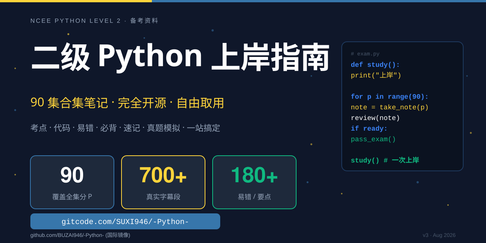

# 二级 Python 上岸指南 · 90 集合集学习笔记

<p align="center">
  
</p>

<p align="center">
  <a href="https://github.com/BUZAI946/-Python-/stargazers"></a>
  <a href="https://github.com/BUZAI946/-Python-/watchers"></a>
  
  
  
</p>

<p align="center">
  <b>🎯 完全开源 · 自由取用</b><br>
  <code>github.com/BUZAI946/-Python-</code>
</p>

---

> B 站 90 集合集深度笔记（BV1Ys4y1D72T）配套学习资料

## 🎯 项目简介

包含 90 个分P的：

- **考点**（核心知识点）
- **典型代码**（含代码示意图）
- **易错 / 要点**（每集 ≥ 2 条）
- **必背**（考试常考）
- **速记**（关键技巧）
- **Whisper 真实听写节选**（每集 6-8 段）

## 📁 文件结构

| 文件 | 内容 |
|---|---|
| `index.html` | 主页：Hero、7 张章节卡、90 集目录索引 |
| `ch1-路线图.html` | 全集学习路线图 |
| `ch2-深度章节.html` | P1 + P3 深度详细讲解 |
| `ch3-第1-4章.html` | 第 1-4 章完整笔记（P2, P4-P28, 26 集）|
| `ch4-第5章.html` | 第 5 章 字符串（P29-P38, 10 集）|
| `ch5-第6-7章.html` | 第 6-7 章 组合类型 + 文件（P39-P57, 19 集）|
| `ch6-第8-10章.html` | 第 8-10 章 模块/库（P58-P68, 11 集）|
| `ch7-真题模拟.html` | 模拟题 + 真题 + 收尾 + 加餐（P69-P90, 22 集）|

## 🚀 使用方式

### 在线浏览

直接打开 `index.html`。

### 本地浏览（推荐）

1. 启动本地 HTTP server：
   ```bash
   cd notebook
   python -m http.server 8765 --bind 127.0.0.1
   ```
2. 浏览器访问 `http://127.0.0.1:8765/index.html`

> HTTP 模式可以正确加载相对路径，渲染更稳定。

## 📊 笔记数据

| 指标 | 数值 |
|---|---|
| 总 P## | 90 集（全覆盖） |
| 听写 quote | 700 段 |
| 要点（tip/warn/must/rush）| 180+ 条 |
| 总大小 | ~530 KB |

## 🛠️ 技术栈

- 单文件 HTML（**离线可用**）
- 纯 CSS / Vanilla JS（无外部依赖）
- 章节页用 sticky 导航条 + 上下页跳转
- 主色：Python 蓝 `#3776AB` + Python 黄 `#FFD43B`

## 🎓 知识点来源

- [国家计算机二级 Python 考试大纲](http://ncre.neea.edu.cn/)
- B 站视频：<https://www.bilibili.com/video/BV1Ys4y1D72T>

## 📜 License

本项目仅用于个人备考学习，请勿传播、商业使用。如有侵权请联系删除。
